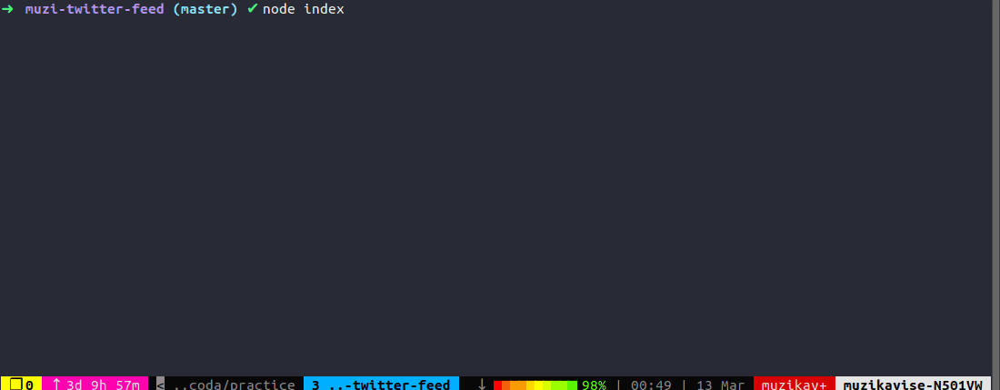

# muzi-twitter-feed

[](muzi-twitter-feed.gif)

---------------------
## Setup Prerequisites
* Node version `v10.15.0` LTS or higher
* Yarn version `1.13.0`
* OS Ubuntu Linux 18.04 LTS

## Installation
To install dependencies, navigate to the project root directory your console and execute the following command:
```shell
yarn install
```

## Test
To run tests
```shell
yarn test
```

## Run
To run solution
```shell
node index.js [full/path/to/user.txt] [full/path/to/tweet.txt]
```

---------------------
## Solution / Tech Stack
1. `chalk` - To add colour to console screen.
2. `commander` - To display default help, and parse arguments.
3. `jest` - For unit testing & coverage report.
4. `prettier`, `husky`, & `lint-staged` - Automatically format code after every commit.

## Project Structure
```
muzi-twitter-feed
└───data
└───src
    └───modules
        └───cli
        └───tweet
        └───user
        └───user-tweet
    └───shared
        └───utils
    |   index.js
    |   index.test.js
|   index.js (entry point)
```